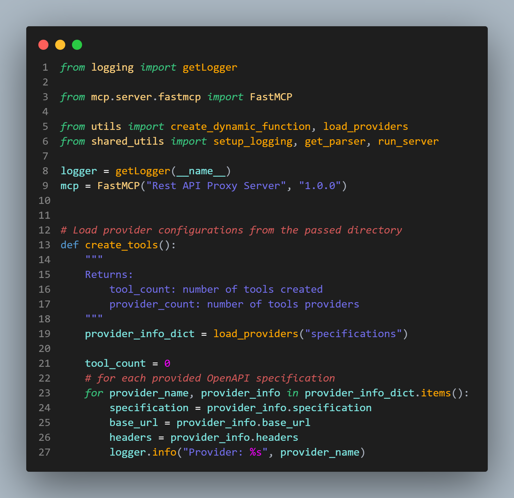

## AP4 Colourful Theme

GitHub repository to maintain my own VS Code theme

Mostly for personal usage, however, feel free to download and use it in your own IDE

For easier installation, [install the extension through VSCode Marketplace](https://marketplace.visualstudio.com/items?itemName=ap4.ap4-colourful-theme)

## Preview (Python)

