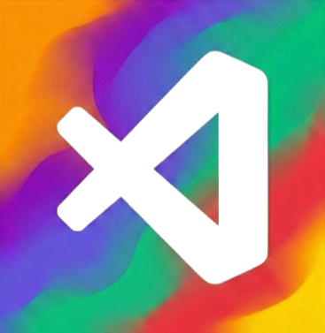
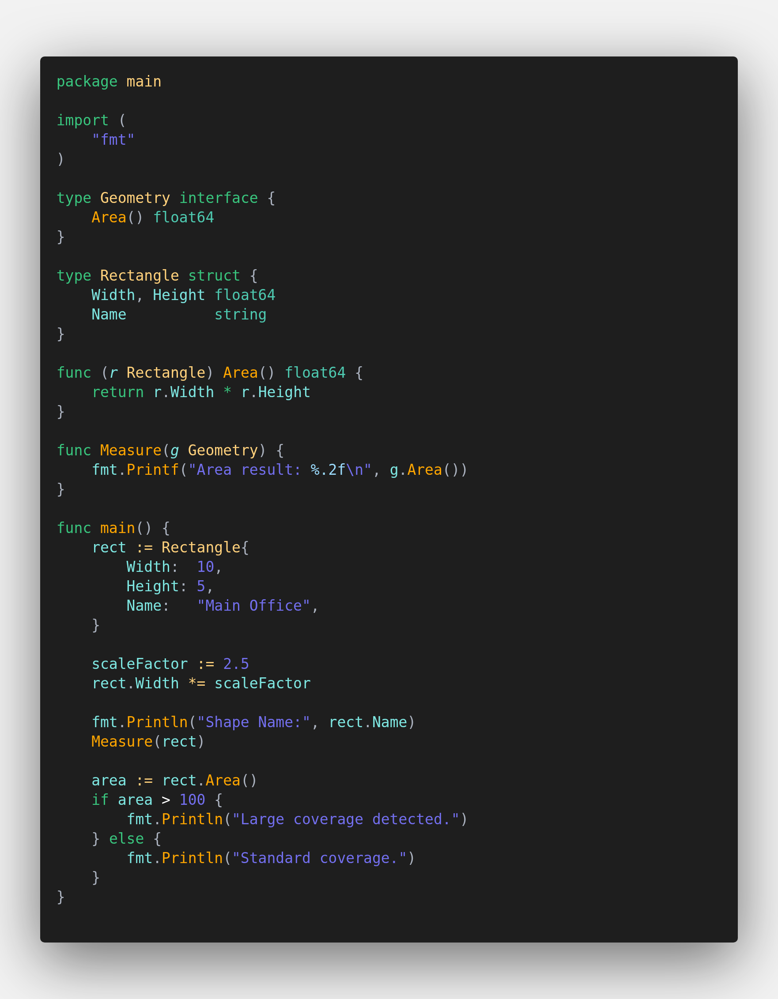
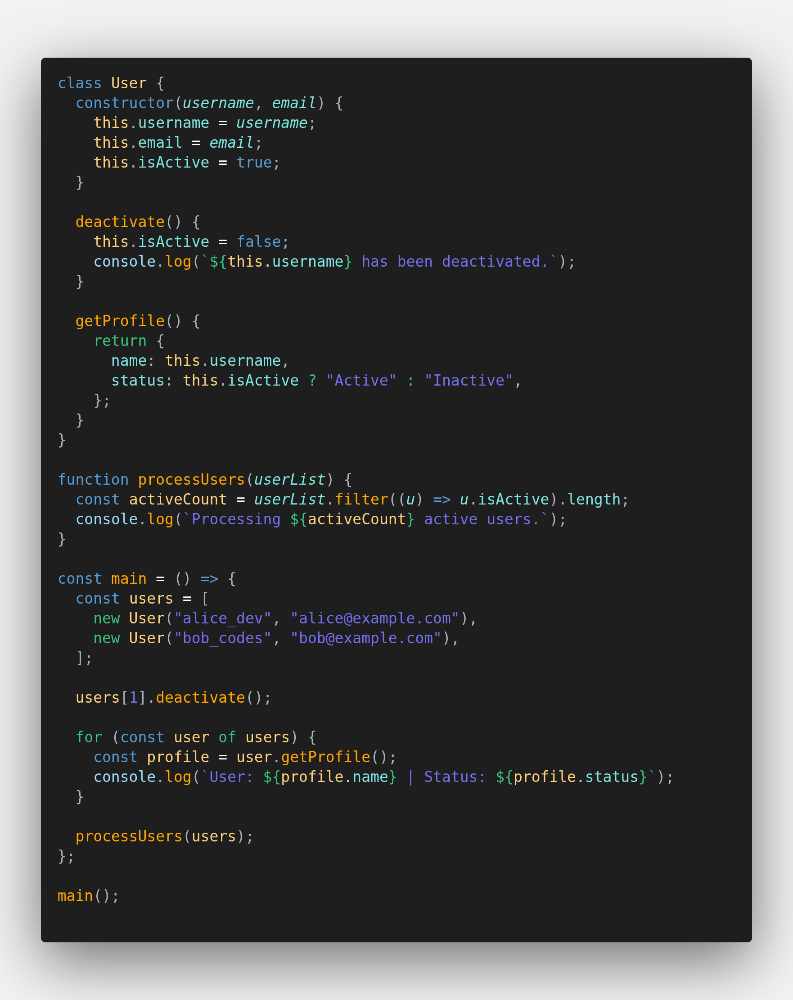
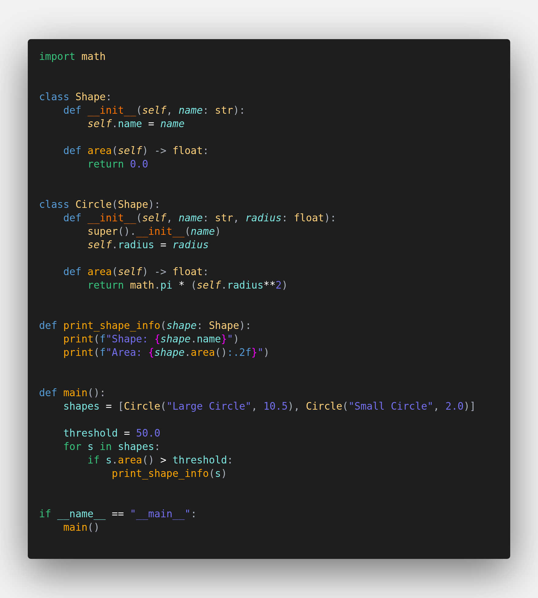
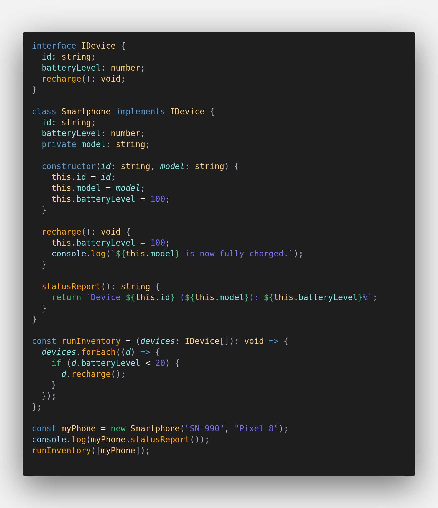
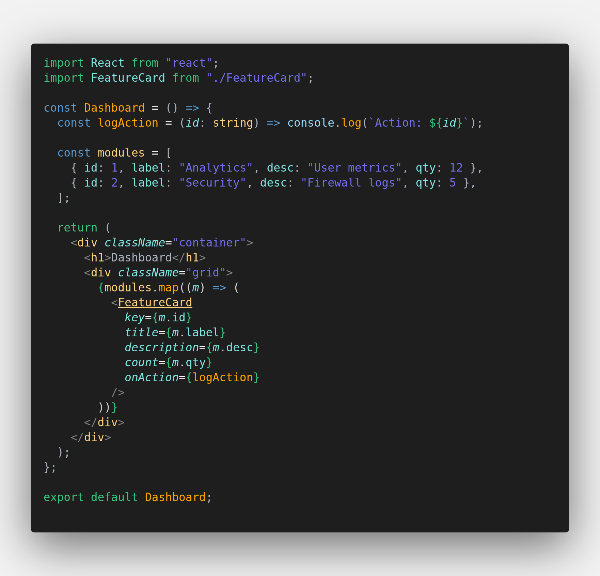

# AP4 Colourful Theme

Available on the [VSCode Marketplace](https://marketplace.visualstudio.com/items?itemName=ap4.ap4-colourful-theme).

An alternative to VSCode's default Dark theme.

While easy on the eyes like the original, it is way more colourful in terms of syntax highlighting, which is what I personally prefer to help mentally visualize what is a variable/object/class/method/keyword in the code.

Works very well for Python, Javacript, Typescript and Golang. Other languages are also well supported, but may need some tweaks on some special syntax and keywords.

## Demos

Check out how the theme looks with different languages:

- **Go**: 
- **JavaScript**: 
- **Python**: 
- **TypeScript**: 
- **TSX**: 